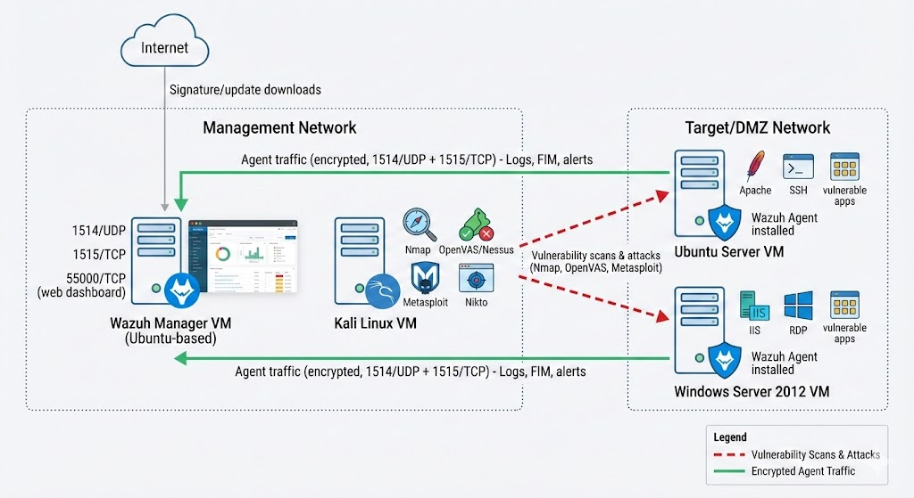

## Overview

This project demonstrates a comprehensive vulnerability assessment performed on a simulated enterprise environment using industry-standard penetration testing tools and methodologies. The assessment identifies security weaknesses across web applications, operating systems, and network services, while implementing real-time monitoring through a centralized SIEM solution.

 

## Architecture

The lab environment consists of four virtual machines within a controlled network:

- **Kali Linux (Attacker VM)**: Primary testing platform equipped with penetration testing tools
- **Ubuntu Server (Target 1)**: Hosts Apache, PHP, MariaDB, and DVWA (Damn Vulnerable Web Application)
- **Windows Server 2012 (Target 2)**: Configured with IIS web services and SMB file sharing, including legacy SMBv1
- **Wazuh SIEM Server**: Centralized logging and monitoring platform with ELK stack integration

All systems are assigned static IP addresses within a shared virtual network, with Wazuh agents deployed on both target servers for log collection and security monitoring.

## Environment Setup

### Target Systems Configuration

**Ubuntu Server**
- Apache web server
- PHP runtime
- MariaDB database
- DVWA deployment for web application testing
- Wazuh agent for log forwarding

**Windows Server 2012**
- IIS web server
- SMB file sharing (including SMBv1)
- Windows firewall disabled for testing
- Wazuh agent for log forwarding

**Wazuh SIEM**
- Centralized log collection
- Real-time security alerting
- Dashboard for event correlation
- Agent management interface

## Methodology

The assessment follows a structured penetration testing workflow:

### Phase 1: Reconnaissance & Discovery
- Network discovery using `ping` and `nmap`
- Live host identification
- IP address confirmation

### Phase 2: Enumeration
- Comprehensive port scanning with Nmap
- Service version detection
- OS fingerprinting
- Banner grabbing

### Phase 3: Vulnerability Scanning
- Automated scanning using Nmap NSE scripts
- Nessus vulnerability assessment
- Manual validation of findings
- False positive filtering

### Phase 4: Web Application Testing
- DVWA manual testing
- SQL injection assessment
- Cross-site scripting (XSS) testing
- Command injection verification
- File upload vulnerability testing
- CSRF vulnerability analysis

### Phase 5: Exploitation
- Selective exploitation of safe vulnerabilities
- SMB vulnerability exploitation using Metasploit
- Web application exploit demonstrations
- Reverse shell establishment

### Phase 6: Detection & Monitoring
- Real-time log analysis via Wazuh
- Security alert correlation
- Attack detection verification
- Dashboard monitoring

## Tools & Technologies

### Penetration Testing Tools
- **Nmap**: Network scanning and service enumeration
- **Metasploit Framework**: Exploitation and post-exploitation
- **GoBuster**: Directory and file brute-forcing
- **Nessus**: Automated vulnerability scanning
- **Burp Suite**: Web application testing
- **Custom scripts**: Various attack vectors

### Monitoring & Detection
- **Wazuh**: SIEM and security monitoring
- **ELK Stack**: Log aggregation and visualization
- **Wazuh Agents**: Endpoint log collection

### Target Applications
- **DVWA**: Deliberately vulnerable web application for testing
- **Apache**: Web server hosting vulnerable applications
- **IIS**: Windows web server for testing
- **SMB**: File sharing protocol with legacy configurations

## Key Findings

### Critical Vulnerabilities

**Ubuntu Server**
- End-of-life Ubuntu 18.04 with Linux kernel 4.15
- Outdated OpenSSH with multiple vulnerabilities
- SQL injection in DVWA
- Reflected XSS vulnerabilities
- Command injection flaws
- Unrestricted file upload
- CSRF vulnerabilities
- Insecure authentication mechanisms

**Windows Server 2012**
- Legacy SMBv1 enabled and exploitable
- Multiple Windows OS-level vulnerabilities
- Missing security patches
- IIS misconfigurations
- Weak SMB configurations

### Discovered Attack Vectors

**Web Application Vulnerabilities**
- Directory enumeration revealing sensitive paths (`/config`, `/database`, `/docs`, `/external`, `/tests`)
- Brute force authentication attacks
- Reflected XSS allowing script injection
- OS command injection via unsanitized input
- Malicious file upload enabling reverse shells
- CSRF enabling unauthorized actions

**Network Service Vulnerabilities**
- SMB exploitation using Metasploit
- Legacy protocol exposure
- Insufficient network segmentation
